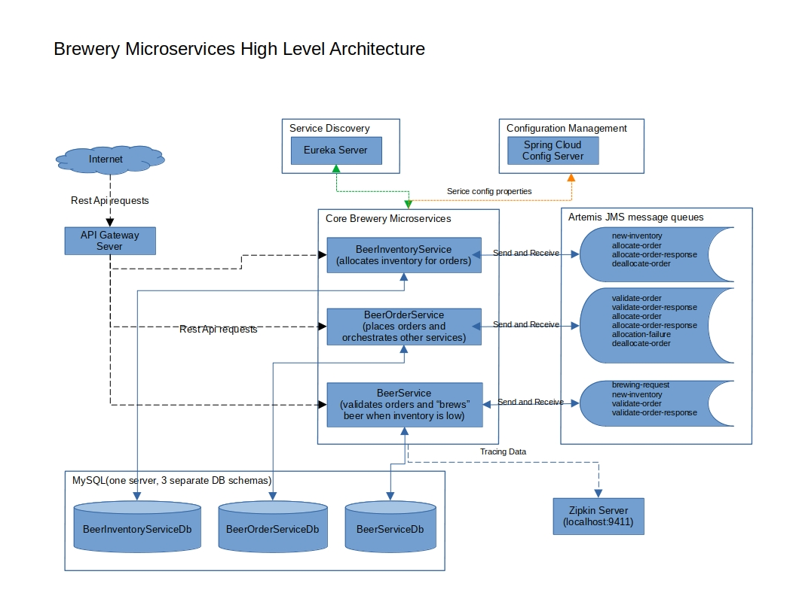

Brewery Microservices
======================================================================================================================
A sample microservices project powered by Spring Boot / Spring Cloud / MySQL / Artemis JMS / Docker.

This project uses a microservices architecture to simulate an order management / inventory management system of an 
imaginary beer brewery.

It showcases some common microservice architecture concepts, including:

- [service discovery](./brewery-eureka/README.md) using netflix eureka server/client
- [centralized service configuration](./brewery-config-server/README.md) using Spring Cloud Config
- [circuit breaker pattern](https://spring.io/projects/spring-cloud-circuitbreaker) to provide failover functionality for the beer-inventory-service
- [API gateway](./brewery-gateway/README.md) running on Spring Cloud Gateway, it uses load-balancing and route matching to route REST API requests to the appropriate microservice
- [distributed tracing](https://spring.io/projects/spring-cloud-sleuth) for microservices using [zipkin](https://zipkin.io/)
- orchestration pattern using [Spring State Machine](https://spring.io/projects/spring-statemachine) to keep track of the state of a beer order as it moves between services

MySql is used as the project database.  Only a single MySQL server instance is started and then shared by the individual
services. Each service has their own database within the server with separate users. This was done to reduce the 
amount of containers that get launched. In an actual production environment, each service would have their own separate DB server.  

[ActiveMQ Artemis](https://activemq.apache.org/components/artemis/), message queues are used to communicate and
maintain the state of the order as it moves through the system.

The entire project has been containerized and can be [run locally](#Running) on your machine using Docker.

Additionally, an example [aws](./aws/README.md) Cloud Development Kit (CDK) project has been provided, that can be used to launch a minimal 
version of this project within Elastic Container Service (ECS). (you are responsible for all AWS fees that will be incurred)

## Overview
The project simulates beer orders being placed by customers from the brewery's tap room. As orders are placed, they get
validated, inventory is updated and then beer is ultimately "delivered" to the customer. Each of these functions
is handled by one of the following microservices:

- [beer-order-service](./beer-order-service/README.md) - simulates the brewery tasting room by generating orders for a random amount
of beer every two seconds. This service is the orchestrator of the other two microservices and maintains the overall 
state of the order by using Spring State Machine.

- [beer-service](./beer-service/README.md) - simulates the beer brewing side of the brewery. It listens on
a message queue for requests to brew more beer, instantly "brews beer", and then notifies the
`beer-inventory-service` that more beer has been brewed. It will periodically call the `beer-inventory-service` to check
how much beer is on hand and then brew more beer if the inventory is below a certain threshold. 
Additionally, this service also validates beer orders from the beer-order-service by verifying the UPC code for each 
beer in the order.

- [beer-inventory-service](./beer-inventory-service/README.md) - maintains the brewery's inventory of beer. It listens
for "new-inventory" events from the beer-service and updates its count of existing beer inventory. It also allocates
and deallocates inventory based on orders coming in from the beer-order-service

- [beer-inventory-failover-service](./beer-inventory-failover-service/README.md) - this example service will handle
  requests to the beer-inventory-service REST Api should it go down.

## High Level architecture

## Running
You should have installed locally: Java 17+, maven 3+, Docker and docker-compose.
At least 8 gigs of ram available to Docker as it will try to start 10 containers.

The easiest way to run is via Docker using the provided [docker-compose](./docker-compose.yml) file:
> docker-compose -f ./docker-compose.yml up

Give docker about a minute to bring up the containers and get in sync.  Eventually, you should see in the docker logs 
that the beer order service is placing an order for a random beer every two seconds.

You can (and should) view the order transactions as the move through the services using the locally running [zipkin web console](http://localhost:9411).
When the zipkin web console appears, click the blue `run query` button, and you should see a list of all completed sagas.

The artemis JMS console is available at: `http:localhost:8161` using an userid and password of `artemis`

## default usernames and passwords
| Service                    | username   | password         |
|----------------------------|------------|------------------|
| MySQL admin account        | root       | password         |
| eureka web console         | netflix    | eureka           |
| config server              | MyUserName | MySecretPassword |
| inventory service REST API | good       | beer             |
| artemis management console | artemis    | artemis          |

## Default Local Port Mappings
| Service Name                    | Port |
|---------------------------------|------|
| Beer Service                    | 8080 |
| Beer Order Service              | 8081 |
| Beer Inventory Service          | 8082 |
| Beer Inventory Failover Service | 8083 |
| Brewery Gateway                 | 9090 |
| Brewery Eureka                  | 8761 |
| Brewery Configuration Server    | 8888 |

## Running on Amazon Web Services
The [aws](./aws) directory contains an example AWS Cloud Development Kit project that will run this project on AWS 
infrastructure. It assumes you have familiarity with AWS and the Cloud Development Kit for TypeScript.
See the project [readme](./aws/README.md) for more information.